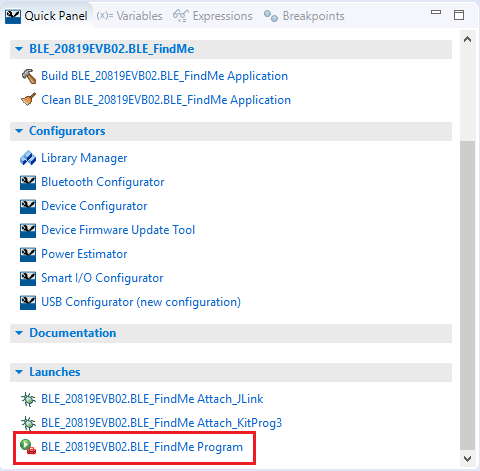
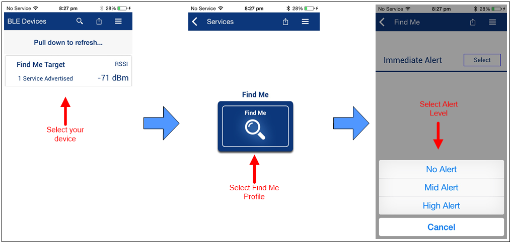
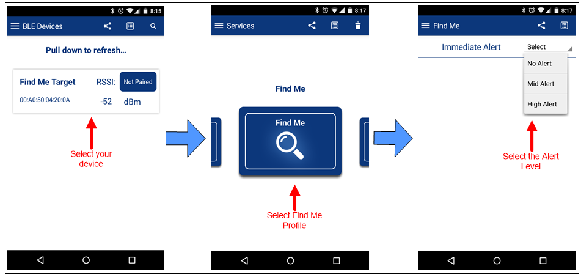
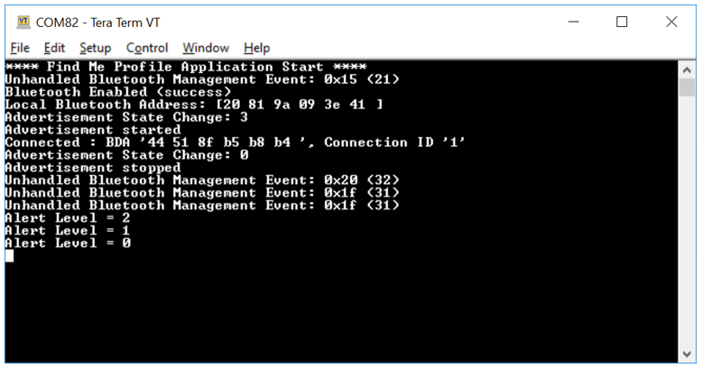
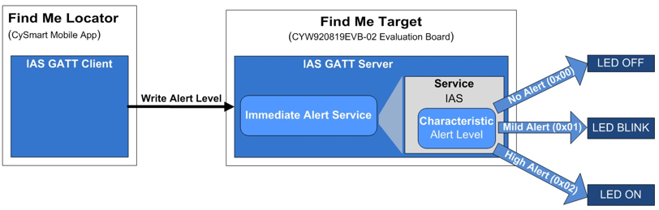

# CE226123 - BLE FindMe

This code example demonstrates the implementation of a simple BLE Immediate Alert Service (IAS)-based Find Me Profile (FMP) using the Cypress Bluetooth SoCs and ModusToolbox™ Integrated Development Environment (IDE).
This document uses CYW20819 as the reference, but the example and instructions in this document are applicable for all supported kits. See the `makefile` file in the *example* folder for a detailed list of supported devices.

## Requirements
- **Tool**: [ModusToolbox™ IDE](https://www.cypress.com/products/modustoolbox-software-environment) v2.0

- **Programming Language**: C

- **Associated Parts**: [CYW20819](https://www.cypress.com/datasheet/CYW20819), [CYW20820](https://www.cypress.com/datasheet/CYW20820), [CYW20719](https://www.cypress.com/documentation/datasheets/cyw20719-enhanced-low-power-bredrble-bluetooth-50-soc)

## Supported Kits
- [CYW920819EVB-02 Evaluation Kit](http://www.cypress.com/CYW920819EVB-02)
- [CYW920820EVB-02 Evaluation kit](http://www.cypress.com/CYW920820EVB-02)
- [CYW920719B2Q40EVB-01 Evaluation kit](https://community.cypress.com/docs/DOC-17736)

See the `makefile` file for a detailed list of supported kits.

**NOTE**: `LED2` is not available on CYW920721B2EVK-03 platform. And the default configuration for that board has no GPIO assigned for `LED1`.  So an application specific design.modus is used to free GPIO P28 from the I2S interface and configure it as an LED with index = 1, output, default=High.  And `LED1` is used for both Advertising and Alert Level functionality on that board.

## Hardware Setup
This example uses the kit’s default configuration. Refer to the [kit guide](http://www.cypress.com/CYW920819EVB-02), if required, to ensure the kit is configured correctly.

## Software Setup
This code example consists of two parts: a locator and a target.

For the locator, download and install the CySmart™ app for [iOS](https://itunes.apple.com/us/app/cysmart/id928939093?mt=8) or [Android](https://play.google.com/store/apps/details?id=com.cypress.cysmart&hl=en).

You can also use the [CySmart Host Emulation Tool](http://www.cypress.com/go/cysmart) Windows PC application if you have access to the [CY5677 CySmart BLE 4.2 USB Dongle](http://www.cypress.com/documentation/development-kitsboards/cy5677-cysmart-bluetooth-low-energy-ble-42-usb-dongle). You can also use other Android or iOS apps that support the IAS service.

Scan the following QR codes from your mobile phone to download the CySmart app.

## Using the Code Example

Refer to the `README` file in the root of the repo for instruction on how to build and program the code example using ModusToolBox IDE and CLI.

## Operation
1. Connect the kit to your PC using the provided USB cable.

   The USB Serial interface on the kit provides access to the two UART interfaces of the CYW20819 device – WICED HCI UART and WICED Peripheral UART (PUART). The HCI UART is used only for downloading the application code in this code example; PUART is for printing the Bluetooth stack and application trace messages.
2. Use your favorite serial terminal application and connect to the PUART serial port. Configure the terminal application to access the serial port using the following settings.
   Baud rate : 115200 bps; Data: 8 bits; Parity : None; Stop : 1 bit; Flow control : None; New line for receive data : Line Feed(LF) or Auto setting

3. Import the code example into a new or existing workspace. See [Importing Code Example into ModusToolbox IDE - KBA225201](https://community.cypress.com/docs/DOC-15968) for details.

4.	Build and program the application: In the project explorer, select the project. The Quick Panel will get populated with various options. Scroll to the **Launches** section, and click the **Program configuration** link as shown in [Figure 1]().

##### Figure 1 Quick Panel with Program Configuration

  **Note:** If the download fails, it is possible that a previously loaded application is preventing programming. For example, the application may use a custom baud rate that the download process does not detect, or the device may be in a low-power mode. In that case, it may be necessary to put the board in recovery mode, and then try the programming operation again from the IDE.
 
  To enter recovery mode, first, press and hold the Recover button (SW1), then press the Reset button (SW2), release the Reset button (SW2), and then release the Recover button (SW1).

5.	Observe the yellow LED (LED1) starts blinking after the device starts advertising.

6.	To test using the CySmart mobile app, do the following (see equivalent CySmart app screenshots in [Figure 2](#figure-2-testing-with-the-cysmart-app-on-ios) and [Figure 3](#figure-3-testing-with-the-cysmart-app-on-android)):
 
    1. Turn ON Bluetooth on your Android or iOS device.

    2. Launch the CySmart app.
 
    3. Press the reset switch on the CYW920819EVB-02 kit to start sending advertisements. The yellow LED (LED1) starts blinking to indicate that advertising has started. Advertising will stop after 90 seconds if a connection has not been established.

    4. Swipe down on the CySmart app home screen to start scanning for BLE Peripherals; your device (“Find Me Target”) appears in the CySmart app home screen. Select your device to establish a BLE connection. Once the connection is established, the yellow LED (LED1) changes from blinking state to always ON state.
 
    5. Select the 'Find Me' Profile from the carousel view.
 
    6. Select an Alert Level value on the Find Me Profile screen. Observe the state of the red LED (LED2) on the device changes based on the alert level.

[Figure 2](#figure-2-testing-with-the-cysmart-app-on-ios) and [Figure 3](#figure-3-testing-with-the-cysmart-app-on-android) show the steps for using CySmart App on iOS and Android respectively.

##### Figure 2. Testing with the CySmart App on iOS

##### Figure 3. Testing with the CySmart App on Android

7.	Use the PUART serial port to view the Bluetooth stack and application trace messages in the terminal window as shown in [Figure 4]().

##### Figure 4. Log Messages on WICED PUART COM Port

## Design and Implementation
The ‘Find Me Locator’ (the BLE Central device) is a BLE GATT Client. The ‘Find Me Target’ (the Peripheral device) is a BLE GATT Server with the IAS implemented, as [Figure 5]() shows.

##### Figure 5. Find Me profile (FMP) Implementation on CYW20819

The BLE Find Me profile defines what happens when the locating Central device broadcasts a change in the alert level.

The Find Me locator performs service discovery using the "GATT Discover All Primary Services" procedure. The BLE Service Characteristic discovery is done by the "Discover All Characteristics of a Service" procedure. When the Find Me Locator wants to cause an alert on the Find Me Target, it writes an alert level in the Alert Level Characteristic of the IAS. When the Find Me Target receives an alert level, it indicates the level using the red LED: OFF for no alert, blinking for mild alert, and ON for high alert.

The application code and Bluetooth stack runs on the Arm® Cortex®-M4 core of the CYW20819 SoC. The important source files relevant for the user application level code for this code example are listed in [Table 1]().

##### Table 1. Important User-Application-Related Source Files

|**File Name**|**Comments**|
|-----------------------------------|-------------------------------------------------------|
|*main.c* | Contains the `application_start()` function, which is the entry point for execution of the user application code after device startup.|
|*app_bt_cfg.c, app_bt_cfg.h* |	These files contain the runtime Bluetooth stack configuration parameters such as device name and  advertisement/ connection settings. Note that the name that the device uses for advertising (“Find Me Target”) is defined in *app_bt_cfg.c*.|
|*app_bt_event_handler.c, app_bt_event_handler.h*|These files contain the code for the Bluetooth stack event handler functions. |
|app_user_interface.c, app_user_interface.h*	|These files contain the code for the application user interface (in this case, the LED) functionality.|
|*cycfg_gatt_db.c, cycfg_gatt_db.h*|	These files reside in the *GeneratedSource* folder under the application folder. They contain the GATT database information generated using the Bluetooth Configurator tool.|

See [AN225684 – Getting Started with CYW208xx](http://www.cypress.com/an225684) application note to understand the firmware design for this code example.

## Resources and Settings
This section explains the ModusToolbox resources and their configuration as used in this code example. Note that all the configuration explained in this section has already been done in the code example. The ModusToolbox IDE stores the configuration settings of the application in the *design.modus* file. This file is used by the graphical configurators, which generate the configuration firmware. This firmware is stored in the application’s *GeneratedSource* folder.

- **Device Configurator:** The Device Configurator is used to enable/configure the peripherals and the pins used in the application. For detailed information on how to use it, see
[Device Configurator Guide](https://www.cypress.com/ModusToolboxDeviceConfig).

- **Bluetooth Configurator:** The Bluetooth Configurator is used for generating/modifying the BLE GATT database. For detailed information on how to use it, see
[Bluetooth Configurator Guide](https://www.cypress.com/ModusToolboxBLEConfig).

## Related Resources

| **Application Notes**                                            |                                                              |
| :----------------------------------------------------------- | :----------------------------------------------------------- |
|[AN225684 – Getting Started with CYW208xx](http://www.cypress.com/an225684) | Describes CYW20819, CYW20820 Bluetooth SoC, software/hardware development ecosystem, and how to build your first BLE application using the device in ModusToolbox IDE.
| **Code Examples**  |
|Visit the BTSDK code examples repository in Cypress GitHub portal for a comprehensive collection of code examples using ModusToolbox IDE|
|**Device Documentation**|
|[CYW20819 Device Datasheet](https://www.cypress.com/datasheet/CYW20819)|
|[CYW20820 Device Datasheet](https://www.cypress.com/datasheet/CYW20820)|
|[CYW20719 Device Datasheet](https://www.cypress.com/documentation/datasheets/cyw20719-enhanced-low-power-bredrble-bluetooth-50-soc)|
|**Development Kits** |
|[CYW920819EVB-02 Evaluation Kit](http://www.cypress.com/CYW920819EVB-02)|
|[CYW920820EVB-02 Evaluation Kit](http://www.cypress.com/CYW920820EVB-02)|
|[CYW920719B2Q40EVB-01 Evaluation kit](https://community.cypress.com/docs/DOC-17736)|
|**Tool Documentation** |
|[ModusToolbox IDE](http://www.cypress.com/modustoolbox)| The Cypress IDE for IoT designers|
--------------------------------------------------------------------------------------------

## Document History

Document Title: CE226123 – BLE Find Me Profile

| Version | Description of Change |
| ------- | --------------------- |
| 1.0.0   | New code example      |

------

-------------------------------------------------------------------------------

© Cypress Semiconductor Corporation, 2019. This document is the property of Cypress Semiconductor Corporation and its subsidiaries (“Cypress”).  This document, including any software or firmware included or referenced in this document (“Software”), is owned by Cypress under the intellectual property laws and treaties of the United States and other countries worldwide.  Cypress reserves all rights under such laws and treaties and does not, except as specifically stated in this paragraph, grant any license under its patents, copyrights, trademarks, or other intellectual property rights.  If the Software is not accompanied by a license agreement and you do not otherwise have a written agreement with Cypress governing the use of the Software, then Cypress hereby grants you a personal, non-exclusive, nontransferable license (without the right to sublicense) (1) under its copyright rights in the Software (a) for Software provided in source code form, to modify and reproduce the Software solely for use with Cypress hardware products, only internally within your organization, and (b) to distribute the Software in binary code form externally to end users (either directly or indirectly through resellers and distributors), solely for use on Cypress hardware product units, and (2) under those claims of Cypress’s patents that are infringed by the Software (as provided by Cypress, unmodified) to make, use, distribute, and import the Software solely for use with Cypress hardware products.  Any other use, reproduction, modification, translation, or compilation of the Software is prohibited.
TO THE EXTENT PERMITTED BY APPLICABLE LAW, CYPRESS MAKES NO WARRANTY OF ANY KIND, EXPRESS OR IMPLIED, WITH REGARD TO THIS DOCUMENT OR ANY SOFTWARE OR ACCOMPANYING HARDWARE, INCLUDING, BUT NOT LIMITED TO, THE IMPLIED WARRANTIES OF MERCHANTABILITY AND FITNESS FOR A PARTICULAR PURPOSE.  No computing device can be absolutely secure.  Therefore, despite security measures implemented in Cypress hardware or software products, Cypress shall have no liability arising out of any security breach, such as unauthorized access to or use of a Cypress product.  CYPRESS DOES NOT REPRESENT, WARRANT, OR GUARANTEE THAT CYPRESS PRODUCTS, OR SYSTEMS CREATED USING CYPRESS PRODUCTS, WILL BE FREE FROM CORRUPTION, ATTACK, VIRUSES, INTERFERENCE, HACKING, DATA LOSS OR THEFT, OR OTHER SECURITY INTRUSION (collectively, “Security Breach”).  Cypress disclaims any liability relating to any Security Breach, and you shall and hereby do release Cypress from any claim, damage, or other liability arising from any Security Breach.  In addition, the products described in these materials may contain design defects or errors known as errata which may cause the product to deviate from published specifications.  To the extent permitted by applicable law, Cypress reserves the right to make changes to this document without further notice. Cypress does not assume any liability arising out of the application or use of any product or circuit described in this document.  Any information provided in this document, including any sample design information or programming code, is provided only for reference purposes.  It is the responsibility of the user of this document to properly design, program, and test the functionality and safety of any application made of this information and any resulting product.  “High-Risk Device” means any device or system whose failure could cause personal injury, death, or property damage.  Examples of High-Risk Devices are weapons, nuclear installations, surgical implants, and other medical devices.  “Critical Component” means any component of a High-Risk Device whose failure to perform can be reasonably expected to cause, directly or indirectly, the failure of the High-Risk Device, or to affect its safety or effectiveness.  Cypress is not liable, in whole or in part, and you shall and hereby do release Cypress from any claim, damage, or other liability arising from any use of a Cypress product as a Critical Component in a High-Risk Device.  You shall indemnify and hold Cypress, its directors, officers, employees, agents, affiliates, distributors, and assigns harmless from and against all claims, costs, damages, and expenses, arising out of any claim, including claims for product liability, personal injury or death, or property damage arising from any use of a Cypress product as a Critical Component in a High-Risk Device.  Cypress products are not intended or authorized for use as a Critical Component in any High-Risk Device except to the limited extent that (i) Cypress’s published data sheet for the product explicitly states Cypress has qualified the product for use in a specific High-Risk Device, or (ii) Cypress has given you advance written authorization to use the product as a Critical Component in the specific High-Risk Device and you have signed a separate indemnification agreement.
Cypress, the Cypress logo, Spansion, the Spansion logo, and combinations thereof, WICED, PSoC, CapSense, EZ-USB, F-RAM, and Traveo are trademarks or registered trademarks of Cypress in the United States and other countries.  For a more complete list of Cypress trademarks, visit cypress.com.  Other names and brands may be claimed as property of their respective owners.
